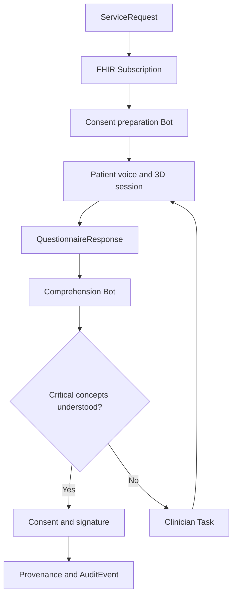

# ConsentLoop 3D

> A signature proves someone clicked. ConsentLoop proves they understood.

ConsentLoop 3D is a voice-guided, interactive informed-consent experience that helps patients understand a medical procedure before signing. It combines adaptive conversation, explorable 3D anatomy, teach-back verification, and a FHIR-native clinical workflow built around Medplum.

Built for the **YC × Medplum Agentic Healthcare Hackathon 2026**.

## The problem

Medical consent is often reduced to a long document and a signature. Patients may agree without understanding:

- what will happen to their body;
- which tissue or organ is affected;
- the expected benefits and material risks;
- available alternatives;
- recovery expectations; or
- the difference between authorization, coverage, and personal cost.

Clinicians rarely have enough time to identify every misconception. A signed form records agreement, but it does not demonstrate comprehension.

## The solution

ConsentLoop turns consent into a measurable clinical workflow.

1. A clinician orders a procedure in Medplum.
2. A FHIR Subscription triggers a Medplum Bot.
3. The Bot creates a personalized consent session and comprehension assessment.
4. A voice agent explains the procedure while controlling an interactive 3D model.
5. The patient compares only the procedure and non-procedure options approved for their case.
6. The app shows the likely timeline, recovery milestones, practical constraints, and cost-estimate inputs for each option.
7. The patient records questions, preferences, and what matters most to them without the app making the clinical decision.
8. The patient interrupts naturally, explores relevant anatomy, and explains the plan back in their own words.
9. Misconceptions are detected and clarified visually and verbally.
10. Medplum records the selected preference, open questions, and structured comprehension results.
11. Critical uncertainty or an unresolved decision creates a clinician Task and blocks completion.
12. Once resolved, the signed Consent and its full audit trail are recorded.

ConsentLoop assists informed-consent education and workflow management. It does not replace the clinician, provide medical advice, or independently determine whether consent is legally valid.

## Interactive UI demo

The repository now includes a complete synthetic patient frontend for Sam Lee's knee-arthroscopy journey. It contains seven responsive views: overview, interactive 3D procedure, option comparison, timeline and recovery planning, cost details, teach-back, and clinician-review handoff. A persistent Deepgram voice guide can explain the synthetic scenario, open any of those views, and control the 3D model with patient-friendly commands.

The 3D viewer now begins with a pearl-white, translucent whole-person model, marks the patient’s right knee, and smoothly travels into the existing separately detailed knee model without rebuilding or downgrading it. Patients can choose front, back, left, right, or three-quarter views; drag to rotate; scroll or pinch to zoom; enter full screen; follow approved procedure steps; or return to the full body at any time. Subtle breathing, sway, and idle rotation stop under reduced-motion preferences. A styled static body-and-knee fallback keeps the educational flow usable when WebGL or a model asset fails.

Every visual mutation now passes through one runtime-validated `VisualizationCommand` controller. Manual controls, the seven Deepgram visual tools, the legacy `consentLoop.viz-command.v1` bridge, and the team’s frozen `SceneCommand` adapter all delegate to the same serialized queue. Voice tool results resolve only after the associated highlight, camera, and exclusive scene handoff settles, so narration stays synchronized with what the patient sees.

See [Person 2 UI handoff](docs/person-2-ui-handoff.md) for the data boundaries, voice command examples, model attribution, and integration checklist.
See [Visualization and voice architecture](docs/visualization-and-voice-architecture.md) for the controller contract, procedure pack schema, Medplum synchronization, and instructions for adding another procedure.
For the live Medplum setup and workflow commands, see the [Person 1 runbook](RUNBOOK-person1.md).

```bash
npm install

# Keep this server-only. Never prefix it with VITE_ or NEXT_PUBLIC_.
# Add it to .env for local Vinext/Cloudflare development.
# The Deepgram key needs Member (or higher) permission for token grants.
DEEPGRAM_API_KEY=your_deepgram_key
MEDPLUM_BASE_URL=https://api.medplum.com/
MEDPLUM_CLIENT_ID=your_client_id
MEDPLUM_CLIENT_SECRET=your_client_secret

npm run dev

# Option-aware Medplum workflow
npm run medplum:deploy
npm run medplum:seed
npm run medplum:smoke:prepare

# Before pushing
npm run lint
npm run typecheck
npm test
npm run selftest
```

## Demo procedure: knee arthroscopy

The hackathon demo focuses on knee arthroscopy because it is visually understandable and supports a clear teach-back moment.

The patient can:

- begin with the whole muscular body and identify the correct side and joint;
- select the right-knee hotspot for a smooth camera move into the joint;
- freely rotate and zoom with drag, wheel, pinch, buttons, or full-screen mode;
- reveal internal joint anatomy;
- highlight the damaged meniscus;
- watch the arthroscope insertion path;
- compare untreated and treated states;
- select risk hotspots; and
- ask questions such as, “Are you replacing my entire knee?”

If the patient incorrectly says, “The surgeon is replacing my entire knee,” ConsentLoop returns to the affected meniscus, highlights only the treated region, explains the distinction, and asks the patient to try again.

## Guided options and decision support

ConsentLoop includes a decision workspace before signature. The clinician or care team defines which choices are medically appropriate for the individual patient; the app does not generate a treatment menu from a diagnosis alone.

Each approved option is shown in a consistent comparison view:

| Category | What the patient sees |
| --- | --- |
| What happens | Plain-language explanation and an option-specific 3D scene |
| Expected benefit | Clinician-approved goal and the uncertainty around the outcome |
| Material risks | Common and serious risks, including how they differ by option |
| Alternatives | Observation, rehabilitation, another procedure, postponement, or declining when applicable |
| Timeline | Decision deadline, preparation, appointment windows, procedure duration, and follow-ups |
| Recovery | Pain and mobility expectations, restrictions, equipment, therapy, driving, work, caregiving, and warning signs |
| Cost details | Facility estimate, professional fees, benefits information, deductible status, copay or coinsurance, included services, and known exclusions |
| Confidence | Source and timestamp for every clinical, scheduling, and financial statement |

Patients can mark an option as **preferred**, **not preferred**, or **unsure**; add a reason; and ask the care team a question. A preference is not treated as consent. The final plan must still be confirmed by an authorized clinician, taught back successfully, and signed through the normal consent workflow.

### Realistic patient scenario

Sam is a synthetic 42-year-old warehouse supervisor with a meniscus tear. The orthopedist has determined that three paths are reasonable for this case:

1. Continue physical therapy for six more weeks and reassess.
2. Schedule arthroscopy with possible partial meniscectomy if the damaged tissue is not repairable.
3. Schedule arthroscopy with meniscus repair if the tissue is repairable, accepting a longer protected recovery.

Sam needs to stand at work, cares for a child on alternate weeks, has a family wedding in five weeks, and has not met the annual deductible. ConsentLoop turns those facts into questions and a side-by-side planning view rather than a recommendation.

| Option | Example timeline | Example recovery | Example cost presentation |
| --- | --- | --- | --- |
| More physical therapy | Two visits per week for six weeks, then clinical review | Usually no surgical downtime; activity may still be limited by symptoms | Remaining authorized visits, copay per visit, and an estimated six-week total |
| Arthroscopy with possible trimming | Available dates, pre-op steps, day-of logistics, and follow-up window | Often earlier weight bearing and return to desk work than repair, but individual restrictions vary | Facility, surgeon, anesthesia, imaging, and therapy estimates shown separately |
| Arthroscopy with possible repair | Same scheduling inputs, with the possibility that the intraoperative finding changes the final procedure | Brace or crutches and a longer period of restricted weight bearing may be required | Range includes the repair scenario and likely additional therapy; uncertainty is explicit |

The app detects conflicts such as “preferred date overlaps the wedding” or “no adult is available for the first night,” then offers actions such as comparing another appointment window or sending a question to the scheduler. It does not conclude that one treatment is best.

Cost figures are estimates, never guarantees. Eligibility data can explain current coverage, but it cannot by itself determine the final patient responsibility. ConsentLoop displays the estimate date, data sources, assumptions, network status, services that may bill separately, and a route to financial counseling. Financial uncertainty never changes the clinical explanation or hides a medically reasonable option.

## Why Medplum is the core

Medplum is not an end-of-session storage layer. It is the system of record and workflow engine for the complete consent lifecycle.



### FHIR resource model

| Resource | Role in ConsentLoop |
| --- | --- |
| `Patient` | Demographics, language, communication, and accessibility context |
| `ServiceRequest` | The ordered procedure that initiates the workflow |
| `Encounter` | Clinical context for the procedure and consent session |
| `Appointment` | Proposed and confirmed procedure, preparation, and follow-up times |
| `HealthcareService` and `Schedule` | Available locations, services, and appointment windows |
| `Questionnaire` | Required comprehension concepts and teach-back rubric |
| `QuestionnaireResponse` | Structured patient answers, priorities, preferences, uncertainty, and comprehension results |
| `Task` | Consent education state and clinician escalation |
| `Consent` | Patient choices and consent lifecycle status |
| `Coverage` | The coverage context used for a financial estimate |
| `CoverageEligibilityResponse` | Eligibility and benefit details returned for the planned service |
| `ClaimResponse` or payer estimate artifact | Pre-service estimate details when available; never represented as a final bill |
| `DocumentReference` | Versioned human-readable consent form and generated summary |
| `Binary` | Protected transcript, audio, or related artifact when required |
| `Provenance` | Source, derivation, authorship, and agent-assisted transformations |
| `AuditEvent` | Trace of access and workflow activity |

### Event-driven workflow

The primary workflow uses two Medplum automations:

1. **Procedure subscription:** watches eligible `ServiceRequest` resources and invokes the consent-preparation Bot.
2. **Assessment subscription:** watches completed or updated `QuestionnaireResponse` resources and invokes the comprehension Bot.

The preparation Bot creates the patient session, assessment, and workflow Task. The comprehension Bot evaluates mandatory concepts, advances or blocks the Task, creates clinician escalation, and controls whether the Consent can become active.

A separate planning step reads clinician-approved alternatives, available appointment windows, recovery content, and financial estimate artifacts. The patient-facing decision snapshot is versioned so the audit trail records exactly what options, dates, assumptions, and prices the patient saw. Any material clinical or financial change invalidates the stale snapshot and prompts review before signature.

## Adaptive 3D consent

The 3D visualization is clinically linked, not decorative. Each required comprehension concept maps to a scene, anatomical mesh, camera position, and voice explanation.

| Consent concept | 3D response |
| --- | --- |
| Whole-person orientation | Show the complete body, mark the right knee, then move into the joint |
| Target anatomy | Highlight the damaged meniscus |
| Procedure action | Animate the arthroscope path |
| Tissue removal | Isolate the region that may be trimmed |
| Infection risk | Highlight incision sites |
| Nearby structures | Reveal adjacent cartilage, ligaments, and nerves |
| Alternative treatment | Return to the untreated state and compare options |

The implemented MVP uses React Three Fiber, Drei, and Three.js with two locally bundled GLB scenes: a complete BodyParts3D model for orientation and the existing Open3DModel knee for close detail. The renderer merges the body’s 418 structures into one web-optimized draw mesh, recolors it as translucent pearl anatomy, and anchors the knee detail with a data-driven `BodyRegion`. Entry now holds the whole-body frame for a visible blue knee highlight, zooms to that region, uses a short empty handoff frame, and only then mounts the detailed knee. The body, marker, and knee model are mutually exclusive, so they never overlap. The detailed knee remains lazily loaded and retains its bones, cartilage, ligaments, meniscus, tear, camera path, treatment, and recovery overlays.

`app/lib/procedure-visualization.ts` defines the approved right-knee region, camera presets, structures, visual modes, and 11-step knee-arthroscopy walkthrough. `app/lib/visualization-controller.ts` validates and reduces the exact high-level command union into a single snapshot containing the explicit loading, overview, focus, procedure, teach-back, misconception, clarification, clinician-review, and return states. Raw transcripts, mesh names, materials, camera coordinates, and DOM elements never cross the voice boundary.

## Voice and comprehension loop

The patient UI now uses Deepgram's unified Voice Agent API for an interruption-friendly live conversation. A user must explicitly start the microphone. The persistent glass voice dock then shows real connection, listening, thinking, and speaking states; supports barge-in; displays live conversation text; accepts typed questions as an accessible alternative; and can be stopped at any time. The right-knee walkthrough is deterministic: whole body, settled knee highlight, settled zoom/detail handoff, and then one configured procedure step per narration turn. Direct voice requests are destination-based: if the viewer is already in another scene, the application automatically returns to the whole body, highlights the right knee, enters the detailed model, and applies the requested approved step as one serialized, renderer-acknowledged plan. Voice-triggered completion remains rejected, and the next narrated walkthrough step cannot start until the prior narration finishes playing or the patient interrupts it. A read-only scene-inspection tool grounds questions such as “what is this yellow part?”, “what is damaged?”, and “what is happening here?” in the exact current model state, highlighted structure, and approved explanation.

The Deepgram API key stays in the Cloudflare Worker. `GET /api/deepgram-token` exchanges it for a short-lived browser grant with same-origin checks, an isolate-local abuse limit, sanitized errors, and `Cache-Control: no-store`. The browser connects to Deepgram with that temporary token and receives no long-lived secret. The included limiter is appropriate only for this owner-only synthetic demo; a public or multi-user deployment must add authenticated app sessions and a durable, shared rate limit before issuing billable tokens.

Client-side voice tools are deliberately read-only. The agent can:

- open Overview, Procedure, Options, Plan, Costs, Teach-back, or Review;
- show an approved whole-body view;
- focus the configured right-knee region;
- enter the approved knee-arthroscopy procedure;
- play one configured procedure step by ID;
- highlight one allowlisted structure with an allowlisted semantic color;
- set normal, transparent, x-ray, or isolated visual mode;
- return to the whole-body overview;
- focus one of the three clinician-approved option cards without recording a preference; and
- prepare a human-help handoff without scheduling, signing, acknowledging, or sending anything on the patient's behalf.

For the planned misconception, the agent may only select the configured `misconception-comparison` and `patient-teachback` steps. The first shows the complete joint faint red and the much smaller possible treatment area orange. A deterministic application assessment—not the language model’s opinion—records the patient’s answer. Contradiction or uncertainty keeps Consent draft, places the education Task on hold, and surfaces clinician review; a correction retains the original misconception in the QuestionnaireResponse and records the clarification.

The system prompt is grounded in the same synthetic fixtures rendered on screen. It frames physical therapy, possible trimming, and possible repair with equal weight; identifies estimates and recovery periods as ranges; never recommends a treatment; and explicitly distinguishes preference from consent.

Moss retrieves the relevant procedure section, risk explanation, or clarification with low latency during the live voice interaction.

The teach-back evaluator classifies each required concept as:

- `understood`;
- `partial`;
- `contradicted`;
- `uncertain`; or
- `not-discussed`.

Critical concepts cannot be silently inferred. Low confidence or contradiction triggers clarification or human review.

`GET/POST /api/consent-workflow` is a same-origin, server-only Medplum adapter. When client credentials are configured, it prefers the option-aware session read model and returns the versioned treatment catalog, patient-specific option snapshot, diagnostic summary, workflow blockers, Task state, comprehension results, and audit events through the existing frontend contract. A teach-back POST records a completed or amended QuestionnaireResponse and invokes the assessment Bot, which recomputes workflow rules and creates clinician review when required; only the guarded workflow can eventually activate Consent. The older session model remains available as a compatibility fallback. When Medplum credentials are absent, the UI says **Demo cache** and persists the synthetic workflow locally so refresh and the full educational walkthrough still work without pretending that FHIR is connected.

## Sponsor technology

### Medplum

- FHIR system of record
- `ServiceRequest`-driven workflow initiation
- Subscriptions and Bots for automation
- Questionnaire-based comprehension protocol
- Task-based clinician escalation
- Consent lifecycle management
- access control, provenance, and auditability

### Deepgram

- streaming medical speech recognition
- natural spoken explanations
- interruption and conversational turn handling
- optional PHI/PII redaction for derived demo artifacts

### Moss

- real-time retrieval of procedure-specific explanations
- semantic matching between patient questions and consent sections
- fast grounding during voice interaction without perceptible retrieval pauses

### Stedi

Optional financial-consent step:

- real-time eligibility and benefits check;
- coverage, copay, and deductible retrieval;
- correction of misconceptions such as “authorization means I owe nothing.”
- clear separation between eligibility information, a pre-service estimate, and the final adjudicated amount.

## Clinician dashboard

The clinician view prioritizes exceptions instead of adding another inbox.

It shows:

- consent sessions by status;
- comprehension score by required concept;
- original misconception and corrected teach-back;
- evidence and transcript excerpts;
- visualization scenes viewed;
- unresolved questions;
- preferred option, stated priorities, and reasons for uncertainty;
- scheduling constraints and recovery-support gaps;
- cost-estimate source, timestamp, assumptions, and acknowledged uncertainties;
- escalation Tasks; and
- a live FHIR event stream.

Example event stream:

```text
ServiceRequest created
Subscription triggered
Consent preparation Bot executed
QuestionnaireResponse updated
Critical misconception detected
Clinician Task created
Misconception resolved
Consent activated
```

Each event can expand to show the underlying Medplum resource.

## Safety principles

- The agent explains clinician-approved content; it does not invent procedure facts.
- Retrieval responses remain grounded in a versioned consent document.
- Critical uncertainty escalates to a clinician.
- A comprehension score is decision support, not a legal conclusion.
- The patient can request a human or stop the session at any time.
- Procedure options come from the treating team and are filtered to the patient's documented clinical context.
- The app records preferences and tradeoffs but does not prescribe, rank options by profit, or select a procedure for the patient.
- Availability and cost never suppress clinically reasonable alternatives.
- Timeline and recovery ranges identify their clinical source and avoid promises about individual outcomes.
- Cost estimates show their source, age, assumptions, network status, and exclusions and are never presented as a guarantee.
- Consent is never activated merely because the model reports high confidence.
- Demo data is synthetic and contains no real patient information.
- Audio retention is optional and governed by access policy.

## MVP scope

### Must have

- Synthetic patient and knee-arthroscopy `ServiceRequest`
- Medplum-triggered consent workflow
- Interactive knee GLB with four guided scenes
- Live voice conversation
- Three teach-back concepts
- One intentionally detectable misconception
- Clinician-approved option comparison with patient preference capture
- Procedure timeline and recovery planner with one scheduling or support conflict
- Itemized synthetic cost estimate with coverage assumptions and uncertainty labels
- Structured `QuestionnaireResponse`
- Clinician escalation `Task`
- Consent status transition
- Visible FHIR event stream

### Stretch goals

- Stedi financial-consent check
- Multilingual explanation and teach-back
- Patient-specific accessibility mode
- Transcript playback synchronized with 3D scenes
- Alternate procedure packs
- AR model viewing on supported mobile devices

## Implemented stack and integration targets

| Layer | Technology |
| --- | --- |
| Frontend | Next App Router on Vinext, React 19, TypeScript, Vite |
| Runtime | Cloudflare Worker and Sites-compatible build |
| UI | Responsive glassmorphic CSS and Lucide icons |
| 3D | React Three Fiber, Drei, Three.js, and an attributed knee GLB |
| Clinical platform | Medplum FHIR, Bots, Subscriptions, AccessPolicy |
| Voice | Deepgram Voice Agent API, Flux speech recognition, managed conversational reasoning, Aura speech, barge-in, live captions, typed fallback, and client-side UI tools |
| Retrieval | Moss semantic search integration target |
| Eligibility | Optional Stedi test-mode healthcare API |
| Validation | ESLint, TypeScript, rendered HTML tests, production build, and credential-free FHIR self-test |

## Repository structure

```text
consentloop-3d/
├── app/                     # Patient UI, 3D viewer, demo data, and command adapters
├── bots/
│   ├── prepare-consent/     # ServiceRequest subscription handler
│   └── assess-teachback/    # QuestionnaireResponse evaluator
├── packages/
│   ├── fhir/                # FHIR fixtures, helpers, and consent state machine
│   └── shared/              # Frozen cross-lane contracts and concept definitions
├── public/models/knee/      # Licensed GLB asset and attribution
├── scripts/                 # Seed, deploy, verify, reset, and self-test workflows
├── worker/                  # Cloudflare/Vinext entry, Deepgram grants, and Medplum adapter
├── docs/                    # UI and integration handoff notes
├── RUNBOOK-person1.md       # Live Medplum setup and troubleshooting
└── README.md
```

## Environment variables

```bash
VITE_MEDPLUM_BASE_URL=
VITE_MEDPLUM_CLIENT_ID=
MEDPLUM_BASE_URL=https://api.medplum.com/
MEDPLUM_CLIENT_ID=
MEDPLUM_CLIENT_SECRET=
DEEPGRAM_API_KEY=
MOSS_PROJECT_ID=
MOSS_PROJECT_KEY=
STEDI_API_KEY=
```

Do not commit real credentials. Use only synthetic patient data during development and demonstration.

## Demo script

1. Create a knee-arthroscopy `ServiceRequest` in Medplum.
2. Show the Subscription firing and the consent Task appearing.
3. Open the patient link and begin the voice session.
4. Compare physical therapy, possible partial meniscectomy, and possible meniscus repair using the same clinical categories.
5. Add the wedding, standing-at-work requirement, caregiving schedule, and lack of first-night support.
6. Show the app flag a timeline conflict and an unresolved recovery-support need without recommending a treatment.
7. Compare synthetic itemized cost ranges and explain why eligibility is not a final price.
8. Record a preferred option and send one unresolved scheduling or financial question to the care team.
9. Begin on the slowly animated translucent body; switch front/back views and focus the right-knee marker.
10. Let the agent travel into the preserved detailed knee and play the approved anatomy, tear, portal, treatment, result, and risk steps.
11. Ask, “Are you replacing my whole knee?”
12. Show the whole joint faint red and the smaller treated meniscus orange.
13. Give the intentionally incorrect teach-back and show QuestionnaireResponse, held education Task, draft Consent, and clinician escalation.
14. Let the guide clarify, then give the corrected teach-back.
15. Return to the full-body view with the knee marked explained and open Review to show the resulting FHIR workflow events.

## Success metrics

- Percentage of critical concepts correctly taught back
- Misconceptions detected before signature
- Sessions requiring clinician intervention
- Time clinicians spend resolving escalations
- Patient-reported confidence before and after visualization
- Percentage of patients who can distinguish their options, timeline, recovery obligations, and estimate assumptions
- Scheduling or at-home support conflicts surfaced before the procedure date
- Financial questions routed to staff before consent completion
- Consent completion without unresolved critical uncertainty

## Hackathon pitch

> ConsentLoop transforms informed consent from a document-signing event into a measurable, FHIR-native clinical workflow. Medplum orchestrates the procedure request, patient assessment, automation, clinician escalation, consent state, and audit history. Voice and interactive 3D make complex procedures understandable, while teach-back verifies that the patient actually understood them.

## License

MIT. Any anatomical models included in the project must retain their original licensing and attribution.
