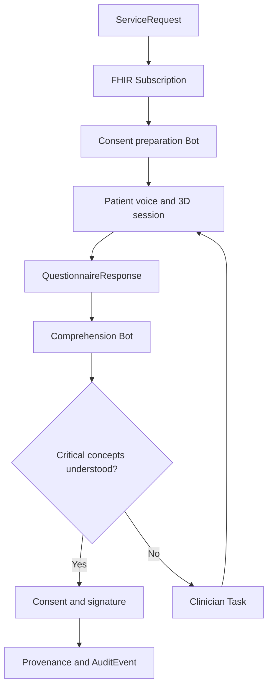

# ConsentLoop 3D

> A signature proves someone clicked. ConsentLoop proves they understood.

ConsentLoop 3D is a voice-guided, interactive informed-consent experience that helps patients understand a medical procedure before signing. It combines adaptive conversation, explorable 3D anatomy, teach-back verification, and a FHIR-native clinical workflow built around Medplum.

Built for the **YC × Medplum Agentic Healthcare Hackathon 2026**.

## The problem

Medical consent is often reduced to a long document and a signature. Patients may agree without understanding:

- what will happen to their body;
- which tissue or organ is affected;
- the expected benefits and material risks;
- available alternatives;
- recovery expectations; or
- the difference between authorization, coverage, and personal cost.

Clinicians rarely have enough time to identify every misconception. A signed form records agreement, but it does not demonstrate comprehension.

## The solution

ConsentLoop turns consent into a measurable clinical workflow.

1. A clinician orders a procedure in Medplum.
2. A FHIR Subscription triggers a Medplum Bot.
3. The Bot creates a personalized consent session and comprehension assessment.
4. A voice agent explains the procedure while controlling an interactive 3D model.
5. The patient interrupts naturally and explores relevant anatomy.
6. The patient explains the procedure back in their own words.
7. Misconceptions are detected and clarified visually and verbally.
8. Medplum records structured comprehension results.
9. Critical uncertainty creates a clinician Task and blocks completion.
10. Once resolved, the signed Consent and its full audit trail are recorded.

ConsentLoop assists informed-consent education and workflow management. It does not replace the clinician, provide medical advice, or independently determine whether consent is legally valid.

## Demo procedure: knee arthroscopy

The hackathon demo focuses on knee arthroscopy because it is visually understandable and supports a clear teach-back moment.

The patient can:

- rotate and zoom the knee;
- reveal internal joint anatomy;
- highlight the damaged meniscus;
- watch the arthroscope insertion path;
- compare untreated and treated states;
- select risk hotspots; and
- ask questions such as, “Are you replacing my entire knee?”

If the patient incorrectly says, “The surgeon is replacing my entire knee,” ConsentLoop returns to the affected meniscus, highlights only the treated region, explains the distinction, and asks the patient to try again.

## Why Medplum is the core

Medplum is not an end-of-session storage layer. It is the system of record and workflow engine for the complete consent lifecycle.



### FHIR resource model

| Resource | Role in ConsentLoop |
| --- | --- |
| `Patient` | Demographics, language, communication, and accessibility context |
| `ServiceRequest` | The ordered procedure that initiates the workflow |
| `Encounter` | Clinical context for the procedure and consent session |
| `Questionnaire` | Required comprehension concepts and teach-back rubric |
| `QuestionnaireResponse` | Structured patient answers, uncertainty, and comprehension results |
| `Task` | Consent education state and clinician escalation |
| `Consent` | Patient choices and consent lifecycle status |
| `DocumentReference` | Versioned human-readable consent form and generated summary |
| `Binary` | Protected transcript, audio, or related artifact when required |
| `Provenance` | Source, derivation, authorship, and agent-assisted transformations |
| `AuditEvent` | Trace of access and workflow activity |

### Event-driven workflow

The primary workflow uses two Medplum automations:

1. **Procedure subscription:** watches eligible `ServiceRequest` resources and invokes the consent-preparation Bot.
2. **Assessment subscription:** watches completed or updated `QuestionnaireResponse` resources and invokes the comprehension Bot.

The preparation Bot creates the patient session, assessment, and workflow Task. The comprehension Bot evaluates mandatory concepts, advances or blocks the Task, creates clinician escalation, and controls whether the Consent can become active.

## Adaptive 3D consent

The 3D visualization is clinically linked, not decorative. Each required comprehension concept maps to a scene, anatomical mesh, camera position, and voice explanation.

| Consent concept | 3D response |
| --- | --- |
| Target anatomy | Highlight the damaged meniscus |
| Procedure action | Animate the arthroscope path |
| Tissue removal | Isolate the region that may be trimmed |
| Infection risk | Highlight incision sites |
| Nearby structures | Reveal adjacent cartilage, ligaments, and nerves |
| Alternative treatment | Return to the untreated state and compare options |

The MVP uses `<model-viewer>` and a GLB model for fast browser rendering, animation, hotspots, camera transitions, and material changes. React Three Fiber or Three.js can replace it later for clipping planes, exploded layers, and advanced shaders.

## Voice and comprehension loop

Deepgram provides low-latency speech-to-text and text-to-speech for an interruption-friendly conversation.

Moss retrieves the relevant procedure section, risk explanation, or clarification with low latency during the live voice interaction.

The teach-back evaluator classifies each required concept as:

- `understood`;
- `partial`;
- `contradicted`;
- `uncertain`; or
- `not-discussed`.

Critical concepts cannot be silently inferred. Low confidence or contradiction triggers clarification or human review.

## Sponsor technology

### Medplum

- FHIR system of record
- `ServiceRequest`-driven workflow initiation
- Subscriptions and Bots for automation
- Questionnaire-based comprehension protocol
- Task-based clinician escalation
- Consent lifecycle management
- access control, provenance, and auditability

### Deepgram

- streaming medical speech recognition
- natural spoken explanations
- interruption and conversational turn handling
- optional PHI/PII redaction for derived demo artifacts

### Moss

- real-time retrieval of procedure-specific explanations
- semantic matching between patient questions and consent sections
- fast grounding during voice interaction without perceptible retrieval pauses

### Stedi

Optional financial-consent step:

- real-time eligibility and benefits check;
- coverage, copay, and deductible retrieval;
- correction of misconceptions such as “authorization means I owe nothing.”

## Clinician dashboard

The clinician view prioritizes exceptions instead of adding another inbox.

It shows:

- consent sessions by status;
- comprehension score by required concept;
- original misconception and corrected teach-back;
- evidence and transcript excerpts;
- visualization scenes viewed;
- unresolved questions;
- escalation Tasks; and
- a live FHIR event stream.

Example event stream:

```text
ServiceRequest created
Subscription triggered
Consent preparation Bot executed
QuestionnaireResponse updated
Critical misconception detected
Clinician Task created
Misconception resolved
Consent activated
```

Each event can expand to show the underlying Medplum resource.

## Safety principles

- The agent explains clinician-approved content; it does not invent procedure facts.
- Retrieval responses remain grounded in a versioned consent document.
- Critical uncertainty escalates to a clinician.
- A comprehension score is decision support, not a legal conclusion.
- The patient can request a human or stop the session at any time.
- Consent is never activated merely because the model reports high confidence.
- Demo data is synthetic and contains no real patient information.
- Audio retention is optional and governed by access policy.

## MVP scope

### Must have

- Synthetic patient and knee-arthroscopy `ServiceRequest`
- Medplum-triggered consent workflow
- Interactive knee GLB with four guided scenes
- Live voice conversation
- Three teach-back concepts
- One intentionally detectable misconception
- Structured `QuestionnaireResponse`
- Clinician escalation `Task`
- Consent status transition
- Visible FHIR event stream

### Stretch goals

- Stedi financial-consent check
- Multilingual explanation and teach-back
- Patient-specific accessibility mode
- Transcript playback synchronized with 3D scenes
- Alternate procedure packs
- AR model viewing on supported mobile devices

## Proposed stack

| Layer | Technology |
| --- | --- |
| Frontend | React, TypeScript, Vite |
| UI | Mantine and Medplum React components |
| 3D | `<model-viewer>` with GLB; Three.js as an upgrade path |
| Clinical platform | Medplum FHIR, Bots, Subscriptions, AccessPolicy |
| Voice | Deepgram streaming STT and Aura TTS |
| Retrieval | Moss semantic search |
| Eligibility | Stedi test-mode healthcare API |
| Validation | Zod and FHIR resource validation |

## Suggested repository structure

```text
consentloop-3d/
├── apps/
│   ├── patient/             # Voice-guided 3D patient experience
│   └── clinician/           # Review queue and FHIR event stream
├── bots/
│   ├── prepare-consent/     # ServiceRequest subscription handler
│   └── assess-teachback/    # QuestionnaireResponse evaluator
├── packages/
│   ├── fhir/                # Profiles, fixtures, and resource helpers
│   ├── procedure-content/   # Approved explanations and concept rubric
│   └── three-d/             # Scenes, hotspots, and camera commands
├── assets/
│   └── models/              # Licensed GLB assets and attribution
├── scripts/
│   └── seed-demo.ts         # Synthetic demo patient and procedure
└── README.md
```

## Environment variables

```bash
VITE_MEDPLUM_BASE_URL=
VITE_MEDPLUM_CLIENT_ID=
MEDPLUM_CLIENT_ID=
MEDPLUM_CLIENT_SECRET=
DEEPGRAM_API_KEY=
MOSS_PROJECT_ID=
MOSS_PROJECT_KEY=
STEDI_API_KEY=
```

Do not commit real credentials. Use only synthetic patient data during development and demonstration.

## Demo script

1. Create a knee-arthroscopy `ServiceRequest` in Medplum.
2. Show the Subscription firing and the consent Task appearing.
3. Open the patient link and begin the voice session.
4. Let the agent guide the 3D procedure visualization.
5. Ask, “Are you replacing my whole knee?”
6. Give the intentionally incorrect teach-back.
7. Show the misconception turn red and the Consent remain blocked.
8. Let the agent focus the model on the meniscus and clarify.
9. Give the corrected teach-back.
10. Show the `QuestionnaireResponse`, completed Task, Consent transition, and audit trail in Medplum.

## Success metrics

- Percentage of critical concepts correctly taught back
- Misconceptions detected before signature
- Sessions requiring clinician intervention
- Time clinicians spend resolving escalations
- Patient-reported confidence before and after visualization
- Consent completion without unresolved critical uncertainty

## Hackathon pitch

> ConsentLoop transforms informed consent from a document-signing event into a measurable, FHIR-native clinical workflow. Medplum orchestrates the procedure request, patient assessment, automation, clinician escalation, consent state, and audit history. Voice and interactive 3D make complex procedures understandable, while teach-back verifies that the patient actually understood them.

## License

MIT. Any anatomical models included in the project must retain their original licensing and attribution.

