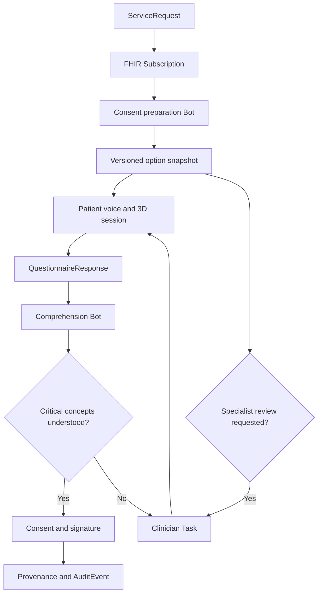

# ConsentLoop 3D

> A signature proves someone clicked. ConsentLoop proves they understood.

ConsentLoop 3D is a voice-guided, interactive informed-consent experience that helps patients discover and understand the clinically relevant paths for a procedure before signing. It combines sourced option discovery, adaptive conversation, explorable 3D anatomy, teach-back verification, and a FHIR-native clinical workflow built around Medplum.

Built for the **YC × Medplum Agentic Healthcare Hackathon 2026**.

## The problem

Medical consent is often reduced to a long document and a signature. Patients may agree without understanding:

- what will happen to their body;
- which tissue or organ is affected;
- the expected benefits and material risks;
- available alternatives;
- recovery expectations; or
- the difference between authorization, coverage, and personal cost.

The options presented can also reflect what one clinician or hospital offers rather than every clinically relevant path. Patients may never learn that a second opinion, referral, non-operative path, or emerging treatment exists, and local unavailability is rarely distinguished from clinical ineligibility.

Clinicians rarely have enough time to identify every misconception. A signed form records agreement, but it does not demonstrate comprehension.

## The solution

ConsentLoop turns consent into a measurable clinical workflow.

1. A clinician orders a procedure in Medplum.
2. A FHIR Subscription triggers a Medplum Bot.
3. The Bot creates a personalized consent session, a sourced option snapshot, and a comprehension assessment.
4. A voice agent explains the procedure while controlling an interactive 3D model.
5. The patient sees every path in the versioned catalog that may be relevant to their documented case, including options unavailable at the current hospital.
6. The app shows the likely timeline, recovery milestones, practical constraints, and cost-estimate inputs for each option.
7. The patient records questions, preferences, and what matters most to them without the app making the clinical decision.
8. The patient interrupts naturally, explores relevant anatomy, and explains the plan back in their own words.
9. Misconceptions are detected and clarified visually and verbally.
10. Medplum records the selected preference, open questions, and structured comprehension results.
11. Critical uncertainty or an unresolved decision creates a clinician Task and blocks completion.
12. Once resolved, the signed Consent and its full audit trail are recorded.

ConsentLoop assists informed-consent education and workflow management. It does not replace the clinician, provide medical advice, or independently determine whether consent is legally valid.

## Interactive UI demo

The repository now includes a complete synthetic patient frontend for Jordan Lee's knee-arthroscopy journey. It contains seven responsive views: overview, interactive 3D procedure, option comparison, timeline and recovery planning, cost details, teach-back, and clinician-review handoff. A persistent Deepgram voice guide can explain the synthetic scenario, open any of those views, and control the 3D model with patient-friendly commands.

The 3D viewer now begins with a complete, locally bundled muscular-body model, marks the patient’s right knee, and smoothly moves from whole-person orientation into a separately detailed knee model. Patients can drag to rotate, scroll or pinch to zoom, use explicit zoom controls, enter full screen, or return to the full body at any time. Every voice-driven action has a manual equivalent. Person 3 can control the viewer through the versioned semantic `consentloop.viz-command.v1` browser contract; Person 1 can replace the typed demo fixtures with Medplum-backed adapters without changing the presentation components.

See [Person 2 UI handoff](docs/person-2-ui-handoff.md) for the data boundaries, voice command examples, model attribution, and integration checklist.
For the live Medplum setup and workflow commands, see the [Person 1 runbook](RUNBOOK-person1.md).

```bash
npm install

# Keep this server-only. Never prefix it with VITE_ or NEXT_PUBLIC_.
# Add it to .env for local Vinext/Cloudflare development.
# The Deepgram key needs Member (or higher) permission for token grants.
DEEPGRAM_API_KEY=your_deepgram_key

npm run dev

# Before pushing
npm run lint
npm test
npm run selftest
```

## Demo procedure: knee arthroscopy

The hackathon demo focuses on knee arthroscopy because it is visually understandable and supports a clear teach-back moment.

The patient can:

- begin with the whole muscular body and identify the correct side and joint;
- select the right-knee hotspot for a smooth camera move into the joint;
- freely rotate and zoom with drag, wheel, pinch, buttons, or full-screen mode;
- reveal internal joint anatomy;
- highlight the damaged meniscus;
- watch the arthroscope insertion path;
- compare untreated and treated states;
- select risk hotspots; and
- ask questions such as, “Are you replacing my entire knee?”

If the patient incorrectly says, “The surgeon is replacing my entire knee,” ConsentLoop returns to the affected meniscus, highlights only the treated region, explains the distinction, and asks the patient to try again.

## Guided options and decision support

ConsentLoop includes a decision workspace before signature. A versioned catalog starts from guideline, regulatory, and clinician-approved sources rather than the services offered by one hospital. It does not claim to contain every treatment worldwide: it shows its source coverage and last review date, and it says when coverage is incomplete.

For each catalogued path, the care team records one clinical status: **appropriate**, **not appropriate**, **needs specialist review**, or **insufficient information**. An option cannot be silently removed; exclusion requires a patient-visible reason and source. Clinical status is kept separate from **available here**, **referral available**, **research only**, and **availability unknown**. This lets a patient discover and ask about a path without the app deciding that they are eligible for it.

Each catalogued option is shown in a consistent comparison view:

| Category | What the patient sees |
| --- | --- |
| What happens | Plain-language explanation and an option-specific 3D scene |
| Expected benefit | Clinician-approved goal and the uncertainty around the outcome |
| Material risks | Common and serious risks, including how they differ by option |
| Alternatives | Observation, rehabilitation, another procedure, postponement, or declining when applicable |
| Evidence and eligibility | Evidence strength, regulatory status, case-specific eligibility questions, and why a clinician included or excluded the option |
| Availability | Offered here, referral available, research only, or unknown; local availability never implies clinical superiority |
| Timeline | Decision deadline, preparation, appointment windows, procedure duration, and follow-ups |
| Recovery | Pain and mobility expectations, restrictions, equipment, therapy, driving, work, caregiving, and warning signs |
| Cost details | Facility estimate, professional fees, benefits information, deductible status, copay or coinsurance, included services, and known exclusions |
| Confidence | Source and timestamp for every clinical, scheduling, and financial statement |

Patients can mark an option as **preferred**, **not preferred**, or **unsure**; add a reason; and ask the care team a question. A preference is not treated as consent. The final plan must still be confirmed by an authorized clinician, taught back successfully, and signed through the normal consent workflow.

### Demo patient journey

Arjun is a synthetic former semi-professional soccer player in India with persistent right-knee discomfort. An initial physical examination and X-ray do not explain the symptoms. After the symptoms continue, an MRI records a complex meniscal tear and additional knee findings. The first hospital discusses arthroscopy: repair the meniscus if the tissue is repairable, or remove only the damaged portion if it is not.

ConsentLoop does not stop at that hospital's menu. It builds this sourced comparison and makes the missing questions visible:

| Path | Clinical status in the demo | Availability | What must be clarified |
| --- | --- | --- | --- |
| Structured rehabilitation and reassessment | Appropriate to discuss | Available locally | Whether symptoms, locking, tear pattern, and prior rehabilitation make a non-operative trial reasonable |
| Arthroscopic meniscus repair | Needs surgeon confirmation | Available locally | Tear location, blood supply, tissue quality, associated injuries, recovery restrictions, and likelihood of repairability |
| Arthroscopic partial meniscectomy | Needs surgeon confirmation | Available locally | Why preservation or repair is not feasible, how much tissue may be removed, and long-term tradeoffs |
| Regenerative or stem-cell-based intervention | Needs regenerative-medicine specialist and regulatory review; not presented as routine standard care | Referral required | Exact product and procedure, evidence for this tear, regulatory status, risks, cost, alternatives, and whether participation is research |

The patient can request a second opinion or referral for any path marked **needs specialist review**, including one the current hospital does not offer. ConsentLoop records the request and keeps consent blocked until the treating team addresses the open alternative. A friend's experience can prompt a question, but it is never treated as clinical evidence.

The evidence label is essential to this demo. AAOS patient guidance describes non-surgical management, physical therapy, repair, and partial meniscectomy as context-dependent paths and emphasizes preserving healthy meniscal tissue. India's January 2026 orthopedic stem-cell guideline includes meniscal tears but conditionally recommends against stem-cell therapy in routine practice because the evidence is very low certainty. In the United States, FDA states that regenerative medicine therapies are not approved for orthopedic conditions. ConsentLoop stores the jurisdiction, source, publication date, review date, and evidence strength instead of flattening established and emerging options into an equal menu.

Primary demo sources:

- [AAOS plain-language summary: Management of Acute Isolated Meniscal Pathology](https://orthoinfo.aaos.org/globalassets/pdfs/plain-language-summary_meniscus-tears-2024.pdf)
- [India Department of Health Research: Evidence-based Guidelines for Stem Cell Therapy in Orthopedic Conditions (January 2026)](https://www.dhr.gov.in/static/uploads/2025/10/f97c65c08c132edfedb703d719ec1748.pdf)
- [FDA: Important Patient and Consumer Information About Regenerative Medicine Therapies](https://www.fda.gov/vaccines-blood-biologics/consumers-biologics/important-patient-and-consumer-information-about-regenerative-medicine-therapies)

Cost figures are estimates, never guarantees. Eligibility data can explain current coverage, but it cannot by itself determine the final patient responsibility. ConsentLoop displays the estimate date, data sources, assumptions, network status, services that may bill separately, and a route to financial counseling. Financial uncertainty never changes the clinical explanation or hides a medically reasonable option.

## Why Medplum is the core

Medplum is not an end-of-session storage layer. It is the system of record and workflow engine for the complete consent lifecycle.



### FHIR resource model

| Resource | Role in ConsentLoop |
| --- | --- |
| `Patient` | Demographics, language, communication, and accessibility context |
| `ServiceRequest` | The ordered procedure that initiates the workflow |
| `Encounter` | Clinical context for the procedure and consent session |
| `DiagnosticReport` and `ImagingStudy` | Sourced diagnostic findings, including the MRI report; the app does not reinterpret raw imaging |
| `PlanDefinition` | Versioned procedure-option catalog with evidence, jurisdiction, and review metadata |
| `CarePlan` | The individualized option snapshot, clinical status, availability, exclusions, referrals, and open questions |
| `Appointment` | Proposed and confirmed procedure, preparation, and follow-up times |
| `HealthcareService` and `Schedule` | Available locations, services, and appointment windows |
| `Questionnaire` | Required comprehension concepts and teach-back rubric |
| `QuestionnaireResponse` | Structured patient answers, priorities, preferences, uncertainty, and comprehension results |
| `Task` | Consent education state and clinician escalation |
| `Consent` | Patient choices and consent lifecycle status |
| `Coverage` | The coverage context used for a financial estimate |
| `CoverageEligibilityResponse` | Eligibility and benefit details returned for the planned service |
| `ClaimResponse` or payer estimate artifact | Pre-service estimate details when available; never represented as a final bill |
| `DocumentReference` | Versioned human-readable consent form and generated summary |
| `Binary` | Protected transcript, audio, or related artifact when required |
| `Provenance` | Source, derivation, authorship, and agent-assisted transformations |
| `AuditEvent` | Trace of access and workflow activity |

### Event-driven workflow

The primary workflow uses two Medplum automations:

1. **Procedure subscription:** watches eligible `ServiceRequest` resources and invokes the consent-preparation Bot.
2. **Assessment subscription:** watches completed or updated `QuestionnaireResponse` resources and invokes the comprehension Bot.

The preparation Bot creates the patient session, option snapshot, assessment, and workflow Task. The comprehension Bot evaluates mandatory concepts, advances or blocks the education Task, and creates clinician escalation. It can mark the session ready, but Consent becomes active only after required human resolutions and the patient's signature.

A separate planning step matches the documented diagnosis and procedure context against the versioned option catalog, then reads clinician decisions, local and referral availability, appointment windows, recovery content, and financial estimate artifacts. The patient-facing decision snapshot is versioned so the audit trail records exactly what options, exclusions, evidence labels, dates, assumptions, and prices the patient saw. Any material clinical, evidence, availability, or financial change invalidates the stale snapshot and prompts review before signature.

## Adaptive 3D consent

The 3D visualization is clinically linked, not decorative. Each required comprehension concept maps to a scene, anatomical mesh, camera position, and voice explanation.

| Consent concept | 3D response |
| --- | --- |
| Whole-person orientation | Show the complete body, mark the right knee, then move into the joint |
| Target anatomy | Highlight the damaged meniscus |
| Procedure action | Animate the arthroscope path |
| Tissue removal | Isolate the region that may be trimmed |
| Infection risk | Highlight incision sites |
| Nearby structures | Reveal adjacent cartilage, ligaments, and nerves |
| Alternative treatment | Return to the untreated state and compare options |

The implemented MVP uses React Three Fiber, Drei, and Three.js with two locally bundled GLB layers: a complete BodyParts3D muscular body for orientation and the Open3DModel knee for close detail. The renderer merges the body’s 418 structures into one web-optimized draw mesh, anchors the knee detail at the correct body location, provides semantic hotspots and smooth camera controls, and adds procedural arthroscopy overlays. Person 3 can send either the team's shared `SceneCommand` contract or the richer versioned `consentloop.viz-command.v1` commands; an explicit adapter keeps raw transcripts and mesh names out of the renderer.

## Voice and comprehension loop

The patient UI now uses Deepgram's unified Voice Agent API for an interruption-friendly live conversation. A user must explicitly start the microphone. The persistent glass voice dock then shows real connection, listening, thinking, and speaking states; supports barge-in; displays live conversation text; accepts typed questions as an accessible alternative; and can be stopped at any time.

The Deepgram API key stays in the Cloudflare Worker. `GET /api/deepgram-token` exchanges it for a short-lived browser grant with same-origin checks, an isolate-local abuse limit, sanitized errors, and `Cache-Control: no-store`. The browser connects to Deepgram with that temporary token and receives no long-lived secret. The included limiter is appropriate only for this owner-only synthetic demo; a public or multi-user deployment must add authenticated app sessions and a durable, shared rate limit before issuing billable tokens.

Client-side voice tools are deliberately read-only. The agent can:

- open Overview, Procedure, Options, Plan, Costs, Teach-back, or Review;
- focus the whole body, right knee, meniscus, tear, ligaments, or camera portals;
- preview orientation, tear, scope, possible treatment, or recovery scenes;
- focus one of the three clinician-approved option cards without recording a preference; and
- prepare a human-help handoff without scheduling, signing, acknowledging, or sending anything on the patient's behalf.

The system prompt is grounded in the same synthetic fixtures rendered on screen. It frames physical therapy, possible trimming, and possible repair with equal weight; identifies estimates and recovery periods as ranges; never recommends a treatment; and explicitly distinguishes preference from consent.

Moss retrieves the relevant procedure section, risk explanation, or clarification with low latency during the live voice interaction.

The teach-back evaluator classifies each required concept as:

- `understood`;
- `partial`;
- `contradicted`;
- `uncertain`; or
- `not-discussed`.

Critical concepts cannot be silently inferred. Low confidence or contradiction triggers clarification or human review.

## Sponsor technology

### Medplum

- FHIR system of record
- `ServiceRequest`-driven workflow initiation
- Subscriptions and Bots for automation
- Questionnaire-based comprehension protocol
- Task-based clinician escalation
- Consent lifecycle management
- access control, provenance, and auditability

### Deepgram

- streaming medical speech recognition
- natural spoken explanations
- interruption and conversational turn handling
- optional PHI/PII redaction for derived demo artifacts

### Moss

- real-time retrieval of procedure-specific explanations
- semantic matching between patient questions and consent sections
- fast grounding during voice interaction without perceptible retrieval pauses

### Stedi

Optional financial-consent step:

- real-time eligibility and benefits check;
- coverage, copay, and deductible retrieval;
- correction of misconceptions such as “authorization means I owe nothing.”
- clear separation between eligibility information, a pre-service estimate, and the final adjudicated amount.

## Clinician dashboard

The clinician view prioritizes exceptions instead of adding another inbox.

It shows:

- consent sessions by status;
- comprehension score by required concept;
- original misconception and corrected teach-back;
- evidence and transcript excerpts;
- visualization scenes viewed;
- unresolved questions;
- preferred option, stated priorities, and reasons for uncertainty;
- scheduling constraints and recovery-support gaps;
- cost-estimate source, timestamp, assumptions, and acknowledged uncertainties;
- escalation Tasks; and
- a live FHIR event stream.

Example event stream:

```text
ServiceRequest created
Subscription triggered
Consent preparation Bot executed
QuestionnaireResponse updated
Critical misconception detected
Clinician Task created
Misconception resolved
Consent activated
```

Each event can expand to show the underlying Medplum resource.

## Safety principles

- The agent explains clinician-approved content; it does not invent procedure facts.
- Retrieval responses remain grounded in a versioned consent document.
- Critical uncertainty escalates to a clinician.
- A comprehension score is decision support, not a legal conclusion.
- The patient can request a human or stop the session at any time.
- Authorized clinicians confirm each option's case-specific status, but the starting catalog is not limited to the current facility's services.
- The option catalog is broader than one facility's service list, shows its coverage limits, and never claims unverified completeness.
- Local unavailability is separate from clinical ineligibility; excluded options retain a patient-visible reason and source.
- Emerging or investigational options display evidence strength, jurisdiction-specific regulatory status, and a specialist-review path without implying efficacy.
- The app records preferences and tradeoffs but does not prescribe, rank options by profit, or select a procedure for the patient.
- Availability and cost never suppress clinically reasonable alternatives.
- Timeline and recovery ranges identify their clinical source and avoid promises about individual outcomes.
- Cost estimates show their source, age, assumptions, network status, and exclusions and are never presented as a guarantee.
- Consent is never activated merely because the model reports high confidence.
- Demo data is synthetic and contains no real patient information.
- Audio retention is optional and governed by access policy.

## MVP scope

### Must have

- Synthetic former-soccer-player journey with physical exam, normal X-ray, MRI findings, and knee-arthroscopy `ServiceRequest`
- Medplum-triggered consent workflow
- Interactive knee GLB with four guided scenes
- Live voice conversation
- Three teach-back concepts
- One intentionally detectable misconception
- Versioned meniscus option catalog covering rehabilitation, repair, partial meniscectomy, and evidence-labelled regenerative medicine
- Clinical relevance separated from local availability, with second-opinion/referral request capture
- Procedure timeline and recovery planner with one scheduling or support conflict
- Itemized synthetic cost estimate with coverage assumptions and uncertainty labels
- Structured `QuestionnaireResponse`
- Clinician escalation `Task`
- Consent status transition
- Visible FHIR event stream

### Stretch goals

- Stedi financial-consent check
- Multilingual explanation and teach-back
- Patient-specific accessibility mode
- Transcript playback synchronized with 3D scenes
- Alternate procedure packs
- AR model viewing on supported mobile devices

## Implemented stack and integration targets

| Layer | Technology |
| --- | --- |
| Frontend | Next App Router on Vinext, React 19, TypeScript, Vite |
| Runtime | Cloudflare Worker and Sites-compatible build |
| UI | Responsive glassmorphic CSS and Lucide icons |
| 3D | React Three Fiber, Drei, Three.js, and an attributed knee GLB |
| Clinical platform | Medplum FHIR, Bots, Subscriptions, AccessPolicy |
| Voice | Deepgram Voice Agent API, Flux speech recognition, managed conversational reasoning, Aura speech, barge-in, live captions, typed fallback, and client-side UI tools |
| Retrieval | Moss semantic search integration target |
| Eligibility | Optional Stedi test-mode healthcare API |
| Validation | ESLint, TypeScript, rendered HTML tests, production build, and credential-free FHIR self-test |

## Repository structure

```text
consentloop-3d/
├── app/                     # Patient UI, 3D viewer, demo data, and command adapters
├── bots/
│   ├── prepare-consent/     # ServiceRequest subscription handler
│   └── assess-teachback/    # QuestionnaireResponse evaluator
├── packages/
│   ├── fhir/                # FHIR fixtures, helpers, and consent state machine
│   └── shared/              # Frozen cross-lane contracts and concept definitions
├── public/models/knee/      # Licensed GLB asset and attribution
├── scripts/                 # Seed, deploy, verify, reset, and self-test workflows
├── worker/                  # Cloudflare/Vinext Worker entry point
├── docs/                    # UI and integration handoff notes
├── RUNBOOK-person1.md       # Live Medplum setup and troubleshooting
└── README.md
```

## Environment variables

```bash
VITE_MEDPLUM_BASE_URL=
VITE_MEDPLUM_CLIENT_ID=
MEDPLUM_BASE_URL=https://api.medplum.com/
MEDPLUM_CLIENT_ID=
MEDPLUM_CLIENT_SECRET=
DEEPGRAM_API_KEY=
MOSS_PROJECT_ID=
MOSS_PROJECT_KEY=
STEDI_API_KEY=
```

Do not commit real credentials. Use only synthetic patient data during development and demonstration.

Person 1 workflow commands:

```bash
cp .env.example .env
npm install
npm test
npm run seed:demo
npm run deploy:prepare
npm run deploy:assess
npm run smoke:prepare
npm run reset:demo
npm run smoke:full
```

The scripts use Node's native `.env` loading. `seed:demo` upserts the synthetic journey and role-scoped access policies. The two deploy commands idempotently deploy the preparation and teach-back Bots and Subscriptions. `smoke:prepare` checks session creation; `smoke:full` safely resets only tagged synthetic resources and proves referral blocking and resolution, contradiction and correction, stale-snapshot review, explicit signature, role-safe read models, and the final audit trail. Run `smoke:full` twice before a demo to verify replay safety.

## Demo script

1. Create a knee-arthroscopy `ServiceRequest` in Medplum.
2. Show the Subscription firing and the consent Task appearing.
3. Open the patient link and begin the voice session.
4. Show the initial examination, normal X-ray, and later MRI findings without having the app reinterpret the scan.
5. Compare rehabilitation, repair, and partial meniscectomy using the same clinical categories.
6. Reveal the evidence-labelled regenerative-medicine path even though the first hospital does not offer it.
7. Request a specialist review and show that local unavailability is not recorded as clinical ineligibility.
8. Compare timelines, recovery constraints, and synthetic itemized cost ranges without recommending a treatment.
9. Record a preferred option and keep Consent blocked while the second-opinion question is unresolved.
10. Let the agent guide the 3D procedure visualization.
11. Ask, “Are you replacing my whole knee?”
12. Give the intentionally incorrect teach-back.
13. Show the misconception turn red and the Consent remain blocked.
14. Let the agent focus the model on the meniscus and clarify.
15. Give the corrected teach-back.
16. Show the option snapshot, referral Task, `QuestionnaireResponse`, completed education Task, Consent transition, and audit trail in Medplum.

## Success metrics

- Percentage of critical concepts correctly taught back
- Misconceptions detected before signature
- Sessions requiring clinician intervention
- Time clinicians spend resolving escalations
- Patient-reported confidence before and after visualization
- Percentage of patients who can distinguish their options, timeline, recovery obligations, and estimate assumptions
- Clinically relevant options surfaced beyond the current facility's service list
- Second-opinion or specialist-review questions resolved before consent
- Scheduling or at-home support conflicts surfaced before the procedure date
- Financial questions routed to staff before consent completion
- Consent completion without unresolved critical uncertainty

## Hackathon pitch

> ConsentLoop transforms informed consent from a document-signing event into sourced option discovery and a measurable, FHIR-native clinical workflow. It exposes clinically relevant paths beyond one facility's service list, labels evidence and availability honestly, and routes second-opinion questions before signature. Medplum orchestrates the procedure request, patient assessment, automation, escalation, consent state, and audit history; voice, interactive 3D, and teach-back make the decision understandable.

## License

MIT. Any anatomical models included in the project must retain their original licensing and attribution.
