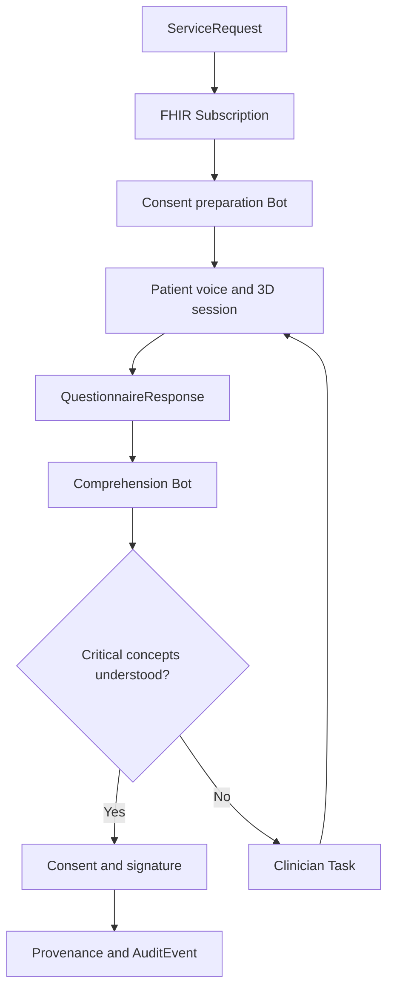

# ConsentLoop 3D

> A signature proves someone clicked. ConsentLoop proves they understood.

ConsentLoop 3D is a voice-guided, interactive informed-consent experience that helps patients understand a medical procedure before signing. It combines adaptive conversation, explorable 3D anatomy, teach-back verification, and a FHIR-native clinical workflow built around Medplum.

Built for the **YC × Medplum Agentic Healthcare Hackathon 2026**.

## The problem

Medical consent is often reduced to a long document and a signature. Patients may agree without understanding:

- what will happen to their body;
- which tissue or organ is affected;
- the expected benefits and material risks;
- available alternatives;
- recovery expectations; or
- the difference between authorization, coverage, and personal cost.

Clinicians rarely have enough time to identify every misconception. A signed form records agreement, but it does not demonstrate comprehension.

## The solution

ConsentLoop turns consent into a measurable clinical workflow.

1. A clinician orders a procedure in Medplum.
2. A FHIR Subscription triggers a Medplum Bot.
3. The Bot creates a personalized consent session and comprehension assessment.
4. A voice agent explains the procedure while controlling an interactive 3D model.
5. The patient compares only the procedure and non-procedure options approved for their case.
6. The app shows the likely timeline, recovery milestones, practical constraints, and cost-estimate inputs for each option.
7. The patient records questions, preferences, and what matters most to them without the app making the clinical decision.
8. The patient interrupts naturally, explores relevant anatomy, and explains the plan back in their own words.
9. Misconceptions are detected and clarified visually and verbally.
10. Medplum records the selected preference, open questions, and structured comprehension results.
11. Critical uncertainty or an unresolved decision creates a clinician Task and blocks completion.
12. Once resolved, the signed Consent and its full audit trail are recorded.

ConsentLoop assists informed-consent education and workflow management. It does not replace the clinician, provide medical advice, or independently determine whether consent is legally valid.

## Demo procedure: knee arthroscopy

The hackathon demo focuses on knee arthroscopy because it is visually understandable and supports a clear teach-back moment.

The patient can:

- rotate and zoom the knee;
- reveal internal joint anatomy;
- highlight the damaged meniscus;
- watch the arthroscope insertion path;
- compare untreated and treated states;
- select risk hotspots; and
- ask questions such as, “Are you replacing my entire knee?”

If the patient incorrectly says, “The surgeon is replacing my entire knee,” ConsentLoop returns to the affected meniscus, highlights only the treated region, explains the distinction, and asks the patient to try again.

## Guided options and decision support

ConsentLoop includes a decision workspace before signature. The clinician or care team defines which choices are medically appropriate for the individual patient; the app does not generate a treatment menu from a diagnosis alone.

Each approved option is shown in a consistent comparison view:

| Category | What the patient sees |
| --- | --- |
| What happens | Plain-language explanation and an option-specific 3D scene |
| Expected benefit | Clinician-approved goal and the uncertainty around the outcome |
| Material risks | Common and serious risks, including how they differ by option |
| Alternatives | Observation, rehabilitation, another procedure, postponement, or declining when applicable |
| Timeline | Decision deadline, preparation, appointment windows, procedure duration, and follow-ups |
| Recovery | Pain and mobility expectations, restrictions, equipment, therapy, driving, work, caregiving, and warning signs |
| Cost details | Facility estimate, professional fees, benefits information, deductible status, copay or coinsurance, included services, and known exclusions |
| Confidence | Source and timestamp for every clinical, scheduling, and financial statement |

Patients can mark an option as **preferred**, **not preferred**, or **unsure**; add a reason; and ask the care team a question. A preference is not treated as consent. The final plan must still be confirmed by an authorized clinician, taught back successfully, and signed through the normal consent workflow.

### Realistic patient scenario

Jordan is a synthetic 42-year-old warehouse supervisor with a meniscus tear. The orthopedist has determined that three paths are reasonable for this case:

1. Continue physical therapy for six more weeks and reassess.
2. Schedule arthroscopy with possible partial meniscectomy if the damaged tissue is not repairable.
3. Schedule arthroscopy with meniscus repair if the tissue is repairable, accepting a longer protected recovery.

Jordan needs to stand at work, cares for a child on alternate weeks, has a family wedding in five weeks, and has not met the annual deductible. ConsentLoop turns those facts into questions and a side-by-side planning view rather than a recommendation.

| Option | Example timeline | Example recovery | Example cost presentation |
| --- | --- | --- | --- |
| More physical therapy | Two visits per week for six weeks, then clinical review | Usually no surgical downtime; activity may still be limited by symptoms | Remaining authorized visits, copay per visit, and an estimated six-week total |
| Arthroscopy with possible trimming | Available dates, pre-op steps, day-of logistics, and follow-up window | Often earlier weight bearing and return to desk work than repair, but individual restrictions vary | Facility, surgeon, anesthesia, imaging, and therapy estimates shown separately |
| Arthroscopy with possible repair | Same scheduling inputs, with the possibility that the intraoperative finding changes the final procedure | Brace or crutches and a longer period of restricted weight bearing may be required | Range includes the repair scenario and likely additional therapy; uncertainty is explicit |

The app detects conflicts such as “preferred date overlaps the wedding” or “no adult is available for the first night,” then offers actions such as comparing another appointment window or sending a question to the scheduler. It does not conclude that one treatment is best.

Cost figures are estimates, never guarantees. Eligibility data can explain current coverage, but it cannot by itself determine the final patient responsibility. ConsentLoop displays the estimate date, data sources, assumptions, network status, services that may bill separately, and a route to financial counseling. Financial uncertainty never changes the clinical explanation or hides a medically reasonable option.

## Why Medplum is the core

Medplum is not an end-of-session storage layer. It is the system of record and workflow engine for the complete consent lifecycle.



### FHIR resource model

| Resource | Role in ConsentLoop |
| --- | --- |
| `Patient` | Demographics, language, communication, and accessibility context |
| `ServiceRequest` | The ordered procedure that initiates the workflow |
| `Encounter` | Clinical context for the procedure and consent session |
| `Appointment` | Proposed and confirmed procedure, preparation, and follow-up times |
| `HealthcareService` and `Schedule` | Available locations, services, and appointment windows |
| `Questionnaire` | Required comprehension concepts and teach-back rubric |
| `QuestionnaireResponse` | Structured patient answers, priorities, preferences, uncertainty, and comprehension results |
| `Task` | Consent education state and clinician escalation |
| `Consent` | Patient choices and consent lifecycle status |
| `Coverage` | The coverage context used for a financial estimate |
| `CoverageEligibilityResponse` | Eligibility and benefit details returned for the planned service |
| `ClaimResponse` or payer estimate artifact | Pre-service estimate details when available; never represented as a final bill |
| `DocumentReference` | Versioned human-readable consent form and generated summary |
| `Binary` | Protected transcript, audio, or related artifact when required |
| `Provenance` | Source, derivation, authorship, and agent-assisted transformations |
| `AuditEvent` | Trace of access and workflow activity |

### Event-driven workflow

The primary workflow uses two Medplum automations:

1. **Procedure subscription:** watches eligible `ServiceRequest` resources and invokes the consent-preparation Bot.
2. **Assessment subscription:** watches completed or updated `QuestionnaireResponse` resources and invokes the comprehension Bot.

The preparation Bot creates the patient session, assessment, and workflow Task. The comprehension Bot evaluates mandatory concepts, advances or blocks the Task, creates clinician escalation, and controls whether the Consent can become active.

A separate planning step reads clinician-approved alternatives, available appointment windows, recovery content, and financial estimate artifacts. The patient-facing decision snapshot is versioned so the audit trail records exactly what options, dates, assumptions, and prices the patient saw. Any material clinical or financial change invalidates the stale snapshot and prompts review before signature.

## Adaptive 3D consent

The 3D visualization is clinically linked, not decorative. Each required comprehension concept maps to a scene, anatomical mesh, camera position, and voice explanation.

| Consent concept | 3D response |
| --- | --- |
| Target anatomy | Highlight the damaged meniscus |
| Procedure action | Animate the arthroscope path |
| Tissue removal | Isolate the region that may be trimmed |
| Infection risk | Highlight incision sites |
| Nearby structures | Reveal adjacent cartilage, ligaments, and nerves |
| Alternative treatment | Return to the untreated state and compare options |

The MVP uses `<model-viewer>` and a GLB model for fast browser rendering, animation, hotspots, camera transitions, and material changes. React Three Fiber or Three.js can replace it later for clipping planes, exploded layers, and advanced shaders.

## Voice and comprehension loop

Deepgram provides low-latency speech-to-text and text-to-speech for an interruption-friendly conversation.

Moss retrieves the relevant procedure section, risk explanation, or clarification with low latency during the live voice interaction.

The teach-back evaluator classifies each required concept as:

- `understood`;
- `partial`;
- `contradicted`;
- `uncertain`; or
- `not-discussed`.

Critical concepts cannot be silently inferred. Low confidence or contradiction triggers clarification or human review.

## Sponsor technology

### Medplum

- FHIR system of record
- `ServiceRequest`-driven workflow initiation
- Subscriptions and Bots for automation
- Questionnaire-based comprehension protocol
- Task-based clinician escalation
- Consent lifecycle management
- access control, provenance, and auditability

### Deepgram

- streaming medical speech recognition
- natural spoken explanations
- interruption and conversational turn handling
- optional PHI/PII redaction for derived demo artifacts

### Moss

- real-time retrieval of procedure-specific explanations
- semantic matching between patient questions and consent sections
- fast grounding during voice interaction without perceptible retrieval pauses

### Stedi

Optional financial-consent step:

- real-time eligibility and benefits check;
- coverage, copay, and deductible retrieval;
- correction of misconceptions such as “authorization means I owe nothing.”
- clear separation between eligibility information, a pre-service estimate, and the final adjudicated amount.

## Clinician dashboard

The clinician view prioritizes exceptions instead of adding another inbox.

It shows:

- consent sessions by status;
- comprehension score by required concept;
- original misconception and corrected teach-back;
- evidence and transcript excerpts;
- visualization scenes viewed;
- unresolved questions;
- preferred option, stated priorities, and reasons for uncertainty;
- scheduling constraints and recovery-support gaps;
- cost-estimate source, timestamp, assumptions, and acknowledged uncertainties;
- escalation Tasks; and
- a live FHIR event stream.

Example event stream:

```text
ServiceRequest created
Subscription triggered
Consent preparation Bot executed
QuestionnaireResponse updated
Critical misconception detected
Clinician Task created
Misconception resolved
Consent activated
```

Each event can expand to show the underlying Medplum resource.

## Safety principles

- The agent explains clinician-approved content; it does not invent procedure facts.
- Retrieval responses remain grounded in a versioned consent document.
- Critical uncertainty escalates to a clinician.
- A comprehension score is decision support, not a legal conclusion.
- The patient can request a human or stop the session at any time.
- Procedure options come from the treating team and are filtered to the patient's documented clinical context.
- The app records preferences and tradeoffs but does not prescribe, rank options by profit, or select a procedure for the patient.
- Availability and cost never suppress clinically reasonable alternatives.
- Timeline and recovery ranges identify their clinical source and avoid promises about individual outcomes.
- Cost estimates show their source, age, assumptions, network status, and exclusions and are never presented as a guarantee.
- Consent is never activated merely because the model reports high confidence.
- Demo data is synthetic and contains no real patient information.
- Audio retention is optional and governed by access policy.

## MVP scope

### Must have

- Synthetic patient and knee-arthroscopy `ServiceRequest`
- Medplum-triggered consent workflow
- Interactive knee GLB with four guided scenes
- Live voice conversation
- Three teach-back concepts
- One intentionally detectable misconception
- Clinician-approved option comparison with patient preference capture
- Procedure timeline and recovery planner with one scheduling or support conflict
- Itemized synthetic cost estimate with coverage assumptions and uncertainty labels
- Structured `QuestionnaireResponse`
- Clinician escalation `Task`
- Consent status transition
- Visible FHIR event stream

### Stretch goals

- Stedi financial-consent check
- Multilingual explanation and teach-back
- Patient-specific accessibility mode
- Transcript playback synchronized with 3D scenes
- Alternate procedure packs
- AR model viewing on supported mobile devices

## Proposed stack

| Layer | Technology |
| --- | --- |
| Frontend | React, TypeScript, Vite |
| UI | Mantine and Medplum React components |
| 3D | `<model-viewer>` with GLB; Three.js as an upgrade path |
| Clinical platform | Medplum FHIR, Bots, Subscriptions, AccessPolicy |
| Voice | Deepgram streaming STT and Aura TTS |
| Retrieval | Moss semantic search |
| Eligibility | Stedi test-mode healthcare API |
| Validation | Zod and FHIR resource validation |

## Suggested repository structure

```text
consentloop-3d/
├── apps/
│   ├── patient/             # Voice-guided 3D patient experience
│   └── clinician/           # Review queue and FHIR event stream
├── bots/
│   ├── prepare-consent/     # ServiceRequest subscription handler
│   └── assess-teachback/    # QuestionnaireResponse evaluator
├── packages/
│   ├── fhir/                # Profiles, fixtures, and resource helpers
│   ├── procedure-content/   # Approved explanations and concept rubric
│   └── three-d/             # Scenes, hotspots, and camera commands
├── assets/
│   └── models/              # Licensed GLB assets and attribution
├── scripts/
│   └── seed-demo.ts         # Synthetic demo patient and procedure
└── README.md
```

## Environment variables

```bash
VITE_MEDPLUM_BASE_URL=
VITE_MEDPLUM_CLIENT_ID=
MEDPLUM_CLIENT_ID=
MEDPLUM_CLIENT_SECRET=
DEEPGRAM_API_KEY=
MOSS_PROJECT_ID=
MOSS_PROJECT_KEY=
STEDI_API_KEY=
```

Do not commit real credentials. Use only synthetic patient data during development and demonstration.

## Demo script

1. Create a knee-arthroscopy `ServiceRequest` in Medplum.
2. Show the Subscription firing and the consent Task appearing.
3. Open the patient link and begin the voice session.
4. Compare physical therapy, possible partial meniscectomy, and possible meniscus repair using the same clinical categories.
5. Add the wedding, standing-at-work requirement, caregiving schedule, and lack of first-night support.
6. Show the app flag a timeline conflict and an unresolved recovery-support need without recommending a treatment.
7. Compare synthetic itemized cost ranges and explain why eligibility is not a final price.
8. Record a preferred option and send one unresolved scheduling or financial question to the care team.
9. Let the agent guide the 3D procedure visualization.
10. Ask, “Are you replacing my whole knee?”
11. Give the intentionally incorrect teach-back.
12. Show the misconception turn red and the Consent remain blocked.
13. Let the agent focus the model on the meniscus and clarify.
14. Give the corrected teach-back.
15. Show the preference snapshot, `QuestionnaireResponse`, completed Task, Consent transition, and audit trail in Medplum.

## Success metrics

- Percentage of critical concepts correctly taught back
- Misconceptions detected before signature
- Sessions requiring clinician intervention
- Time clinicians spend resolving escalations
- Patient-reported confidence before and after visualization
- Percentage of patients who can distinguish their options, timeline, recovery obligations, and estimate assumptions
- Scheduling or at-home support conflicts surfaced before the procedure date
- Financial questions routed to staff before consent completion
- Consent completion without unresolved critical uncertainty

## Hackathon pitch

> ConsentLoop transforms informed consent from a document-signing event into a measurable, FHIR-native clinical workflow. Medplum orchestrates the procedure request, patient assessment, automation, clinician escalation, consent state, and audit history. Voice and interactive 3D make complex procedures understandable, while teach-back verifies that the patient actually understood them.

## License

MIT. Any anatomical models included in the project must retain their original licensing and attribution.
