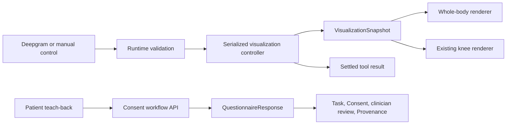

# Visualization and voice architecture

ConsentLoop uses one high-level controller to connect the lightweight whole-body overview, the existing detailed knee renderer, Deepgram client tools, manual controls, and legacy team contracts. This keeps clinical meaning outside Three.js and prevents voice output from manipulating cameras, meshes, materials, the DOM, or Medplum resources directly.

## Runtime flow

The controller lives in `app/lib/visualization-controller.ts`. It accepts the strictly typed `VisualizationCommand` union from `app/lib/procedure-visualization.ts`, rejects unknown IDs and extra payload fields, serializes commands, and resolves only after the configured transition time. Its snapshot is the sole source of truth for scene level, body view, active region, procedure step, visual mode, highlights, misconception comparison, camera controls, completion, and revision.

The supported high-level commands are:

- `SHOW_BODY_OVERVIEW`
- `FOCUS_BODY_REGION`
- `ENTER_PROCEDURE`
- `PLAY_PROCEDURE_STEP`
- `HIGHLIGHT_STRUCTURE`
- `SET_VISUAL_MODE`
- `RETURN_TO_OVERVIEW`
- `RESET_VISUALIZATION`

Manual rotate, zoom, and idle-rotation controls use the same controller through a small internal control union. `window.consentLoop3D`, `window.consentLoopViz`, DOM scene-command events, and the frozen shared `SceneCommand` remain compatibility adapters; none owns independent renderer state.

## Body overview and procedure adapter

`KneeViewer.tsx` uses one Canvas and two connected layers:

1. BodyParts3D is Draco-compressed, normalized, merged to one geometry, and rendered as pearl/cool-gray translucent anatomy with an inexpensive blue internal impression. A configured overlay marks the right knee.
2. The existing Open3DModel knee stays intact and lazily mounts for detailed steps. Its established bone, cartilage, ligament, meniscus, tear, scope, treatment, and recovery behavior is driven by a projection of the controller snapshot.

During entry the controller first focuses the configured region. The renderer holds the whole-body framing long enough for the blue right-knee pulse to register, moves the camera to the region preset, clears the body and marker through a short empty handoff frame, and only then mounts the detailed knee. The body and detailed model are mutually exclusive; there is no persistent crossfade or anatomical overlap. Return uses the same exclusive handoff in reverse. Reduced-motion users keep the scene separation with only a minimal handoff frame and no breathing, sway, pulsing, or automatic rotation. A styled static silhouette with a right-knee marker catches WebGL and asset errors.

## Deepgram tools

`app/lib/voice-agent.ts` exposes exactly seven visual client tools:

- `show_body_overview(view)`
- `focus_body_region(regionId)`
- `enter_procedure(procedureId)`
- `play_procedure_step(procedureId, stepId)`
- `highlight_structure(structureId, color)`
- `set_visual_mode(mode)`
- `return_to_overview()`

`voiceToolToVisualizationCommand` is the only voice-to-renderer adapter. All arguments are allowlisted twice: first when the Deepgram wire call is normalized, then when the controller executes it. Procedure entry is rejected until the right knee has been focused, and detailed steps are rejected until entry settles. The bridge waits for the renderer to acknowledge the expected body or knee layer before returning success, including in reduced-motion mode. Deepgram receives one canonical configured utterance and settled scene metadata after each tool result, may execute only one visual transition per function-call request, and advances through the walkthrough one narration turn at a time. Skips, rewinds, and voice-triggered completion are rejected; completion remains an application action after assessed teach-back. The next visual stays blocked until audio playback finishes or the patient interrupts. Nonvisual tools may still open a consent section, focus an equal-weight option card, or prepare a confirmed human handoff.

The whole-knee misconception is a configured sequence rather than model-generated behavior. `misconception-comparison` renders the complete joint faint red and the possible treated meniscus orange. `patient-teachback` asks the approved prompt and waits. The application then records an `understood`, `contradicted`, or `uncertain` result; visual tools cannot grade or store it.

## Medplum synchronization

The server-only `GET/POST /api/consent-workflow` endpoint uses Medplum client credentials when configured. GET builds an aggregate context from Patient, ServiceRequest, affected `bodySite`, education Task, Questionnaire, QuestionnaireResponse, Consent, clinician-review Task, and Provenance. POST validates a single approved teach-back result, immutably upserts the concept group, and applies the existing workflow rules.

Safety invariants:

- this endpoint never completes a QuestionnaireResponse;
- it rejects writes to an already finalized response;
- contradiction or uncertainty keeps Consent draft and creates/surfaces clinician review;
- correction preserves the original misconception and records clarification;
- Consent activation remains an explicit separate workflow decision;
- missing credentials produce an honest disconnected state, not fake FHIR data.

The browser stores a synthetic snapshot only as a transparent reconnectable demo fallback. When Medplum responds, its snapshot replaces the cache and remains authoritative.

## Add another procedure

1. Add a properly licensed, web-sized detail asset under `public/models/<procedure>/` with attribution.
2. Add a `BodyRegion` containing the semantic region ID, side, world anchor, camera position/target, highlight color, and procedure scene ID. Do not scatter coordinates through components.
3. Add the procedure ID, approved structure IDs, and `ProcedureStep[]` in `procedure-visualization.ts`. Each step needs approved narration, one scene command, renderer projection, and optional comprehension concept/prompt.
4. Add a narrow renderer adapter that consumes `VisualizationSnapshot`; do not copy the controller or expose Three.js objects.
5. Add the procedure code-to-configuration mapping in the Medplum aggregate context.
6. Add the new IDs to Deepgram schemas by importing the same configuration constants. Do not duplicate string lists.
7. Test every step ID, invalid region/procedure/structure payloads, entry/return transitions, reduced motion, fallback, refresh restoration, and the procedure-specific misconception.

## Demo sequence

1. Open on the animated body overview.
2. Show front and back presets.
3. Focus `right-knee`.
4. Enter `knee-arthroscopy`.
5. Play the approved anatomy, damage, access, treatment, result, and risk steps.
6. Play `misconception-comparison` and `patient-teachback`.
7. Submit an incorrect answer, then a corrected one.
8. Return to overview and inspect the Review event stream.
